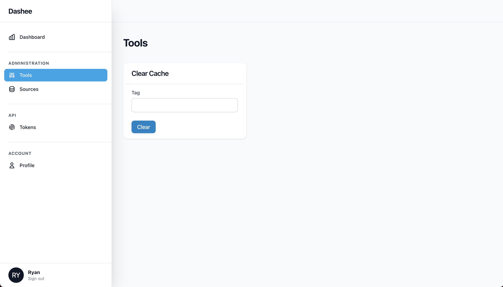

# Add a general-purpose tools page to your Filament project.

[](https://packagist.org/packages/ryangjchandler/filament-tools)
[](https://github.com/ryangjchandler/filament-tools/actions?query=workflow%3Arun-tests+branch%3Amain)
[](https://github.com/ryangjchandler/filament-tools/actions?query=workflow%3A"Check+%26+fix+styling"+branch%3Amain)
[](https://packagist.org/packages/ryangjchandler/filament-tools)



## Installation

You can install the package via Composer:

```bash
composer require ryangjchandler/filament-tools
```

Optionally, you can publish the views using

```bash
php artisan vendor:publish --tag="filament-tools-views"
```

## Usage

This package will automatically register a new `RyanChandler\FilamentTools\Tools` page in your Filament panel.

### Registering a new tool

You can register a new tool by calling the `Tools::register()` function, providing a `Closure` as the only argument.

```php
use RyanChandler\FilamentTools\Tools;
use RyanChandler\FilamentTools\Tool;

public function boot()
{
    Tools::register(function (Tool $tool): Tool {
        return $tool->label('Clear Cache');
    });
}
```

All tools **require** a label. If a label isn't provided, an instance of `RyanChandler\FilamentTools\Exception\ToolsException` will be thrown.

> The provided `Closure` will be executed via the container so you can type-hint any dependencies you need.

### Tool forms

Each tool can contain it's own unique form. This form makes is simple to ask for input from the user and execute logic based on that input. You can provide your form's schema to the `Tool::schema()` method.

```php
Tools::register(function (Tool $tool): Tool {
    return $tool
        ->label('Clear Cache')
        ->schema([
            TextInput::make('tag')
                ->nullable(),
        ]);
});
```

To run some logic when the form is submitted you can use the `Tool::onSubmit()` method, providing a `Closure` as the only argument. This `Closure` will receive an instance of `RyanChandler\FilamentTools\ToolInput`. This class extends `Illuminate\Support\Collection` so you are free to call any existing Collection methods.

```php
Tools::register(function (Tool $tool): Tool {
    return $tool
        ->label('Clear Cache')
        ->schema([
            TextInput::make('tag')
                ->nullable(),
        ])
        ->onSubmit(function (ToolInput $input) {
            $tag = $input->get('tag');

            // Do something cool here...
        });
});
```

### Rendering a custom view

You can provide a custom view to render inside of the tool by calling the `Tool::view()` method.

```php
Tools::register(function (Tool $tool): Tool {
    return $tool
        ->label('Clear Cache')
        ->view('tools.clear-cache');
});
```

### Customising the column span

Each row on the tools page operates on a 12-column grid. The default width for a tool is **3 columns**.

If you would like to customise the width of your tool, you can use the `Tool::columnSpan()` method.

```php
Tools::register(function (Tool $tool): Tool {
    return $tool
        ->label('Clear Cache')
        ->columnSpan(6);
});
```

## Testing

```bash
composer test
```

## Changelog

Please see [CHANGELOG](CHANGELOG.md) for more information on what has changed recently.

## Contributing

Please see [CONTRIBUTING](.github/CONTRIBUTING.md) for details.

## Security Vulnerabilities

Please review [our security policy](../../security/policy) on how to report security vulnerabilities.

## Credits

- [Ryan Chandler](https://github.com/ryangjchandler)
- [All Contributors](../../contributors)

## License

The MIT License (MIT). Please see [License File](LICENSE.md) for more information.
